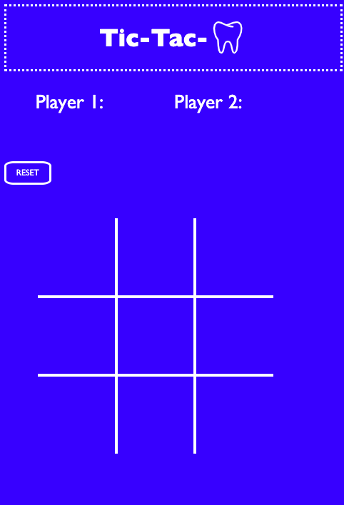

# Tic-Tac-Tooth

Which player will the tooth fairy visit? What will come next? Play now in this game of [Tic-Tac-Tooth](https://nikkiricks.github.io/Tic-Tac-Tooth/).

## Features

- animated score board
- reset button

## Planning Process

### Choosing a theme

I brain stormed different theme options, tic-tac-yum, a foodie based app. Tic-tac-Holier-Than-Though, a battle between Gandhi and the Pope, and tic-tac-trump

### Wrote out psuedo code and html layout

Pen to paper I drew how I wanted the overall look to be. Then I typed out what the game needed to do:

- create two players
- mark a box
- track boxes marked
- track conditions for all possible 8 wins
- create a score board
- reset game

## Challenges

- Thinking through all possible scenerios for a win
- Adding more features with existing code and understanding what to update where

### Unsolved Problems & Bonus Features

#### JS

- Make it so it's not allowed to click on the same grid box twice
- Make it so after final winner is declared the game is over
- Have a draw option

#### CSS

- Make the images random
- Make a draw through the boxes animation
- Create a cover page where you click the tooth to enter

## Art Credit

- Noun Project
- [Bobby-Clark](https://www.si.com/nhl/photos/2011/02/11hockeys-all-time-best-toothless-smiles#1)
- Picture of Sloane by [Brandon-Crockett](https://www.crockettcopy.com/)
